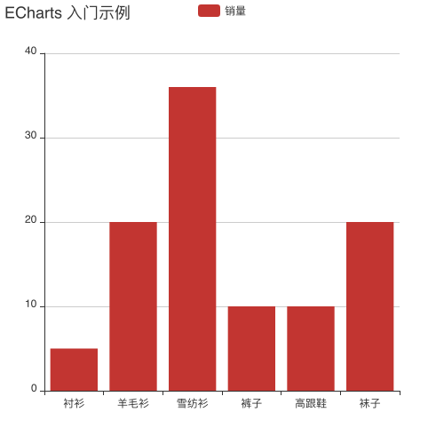
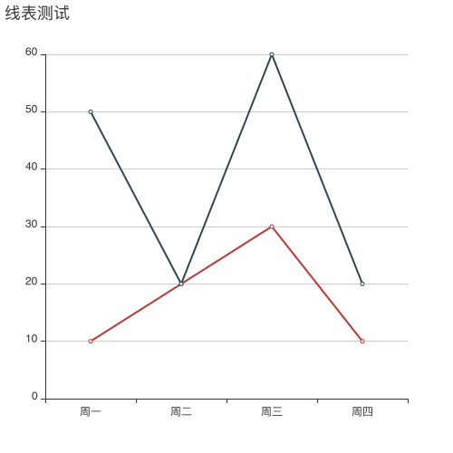
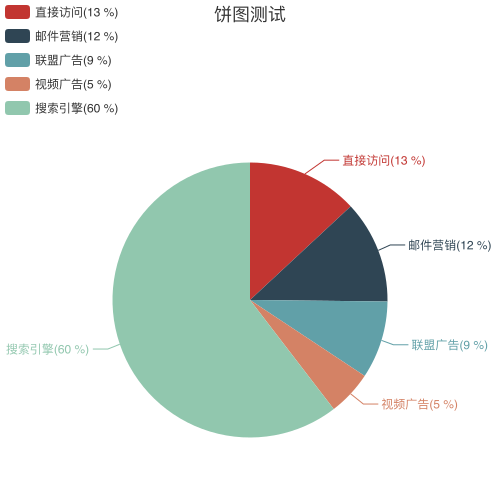

# ECharts image server

ECharts图表接口，通过URL直接返回图像，方便发送邮件或机器人等

## API

### 自定义样式
```
GET http://echarts.pipelinecraft.com/api?option={"title":{"text":"ECharts%20入门示例"},"tooltip":{},"legend":{"data":["销量"]},"xAxis":{"data":["衬衫","羊毛衫","雪纺衫","裤子","高跟鞋","袜子"]},"yAxis":{},"series":[{"name":"销量","type":"bar","data":[5,20,36,10,10,20]}]}
```
返回：



其中option为ECharts表中的数据

### 折线图测试
```
GET http://echarts.pipelinecraft.com/api/line?title=折线图测试&data=[{"value":335,"name":"直接访问"},{"value":310,"name":"邮件营销"},{"value":234,"name":"联盟广告"},{"value":135,"name":"视频广告"},{"value":1548,"name":"搜索引擎"}]
```
返回：



其中data表示数据，第一行为标题，后面为数据


### 饼图测试
```
GET http://echarts.pipelinecraft.com/api/pie?title=饼图测试&data=[{"value":335,"name":"直接访问"},{"value":310,"name":"邮件营销"},{"value":234,"name":"联盟广告"},{"value":135,"name":"视频广告"},{"value":1548,"name":"搜索引擎"}]
```
返回：



其中data表示数据